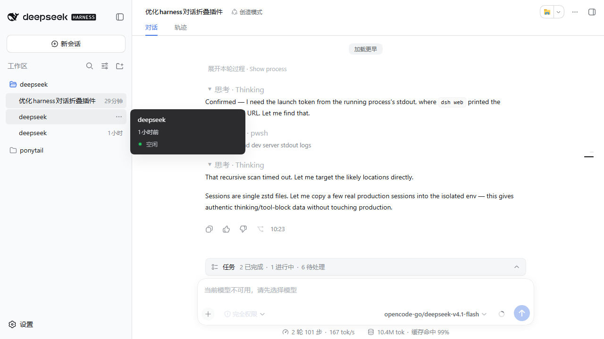

# dsh-chat-fold · 对话折叠

> 让 DeepSeek Harness 的对话正文能真正收起来：**每条思考行与工具行都可以单独点开/收起**，已结束的回合自动折叠中间过程，只留最终答复。

<p align="center">
  
  
  
</p>

---

## 它解决什么问题

Harness 其实**已经有**「回合过程折叠」，而且 `Compact` 就是默认值。问题是那条折叠是一条 React 投影，它的生效条件是：

```
processWindowReady = compactTranscript
                  && answerAnchorSeq !== null
                  && turnClosed           // ← 回合必须已经结束
                  && !historyIncomplete   // ← 历史必须已经全部加载
```

于是只要满足下面任意一条，**一行都不会折叠**：

| 情况 | 为什么 |
|---|---|
| 回合还在跑 | `turnClosed` 为假 |
| 会话还挂着「加载更早」 | `historyIncomplete` 为真 |

而这两种情况恰恰是正文最长的时候。一个较长的 agent 回合会把几十条「思考」与「Pwsh / Read / Edit」行平铺在正文里，读者想回看之前的内容，只能一路滚过整面墙。

本插件在**不改写、不替换任何官方节点**的前提下补上这一层。

## 装完的效果



- **单行折叠**：每条过程行前面多一个 `▾ 思考 · Thinking` / `▾ 工具调用 · pwsh` 标题，点它就是收起/展开**这一行**。
- **整轮折叠**：每一轮上方有一个 `折叠本轮过程 / 展开本轮过程`，一键处理整轮。
- **自动折叠**：已经结束的回合默认收起过程行，只留最终答复；**最新那一轮保持展开**，正在写的答复照常可读。

实测（94 行的长回合）：

| 状态 | 正文高度 |
|---|---|
| 默认展开 | 4616 px |
| 本插件折叠后 | **263 px** |

## 安装

```bash
dsh plugin --profile web add github:HaydenSmith1121/dsh-chat-fold
```

重启 `dsh web` 后生效。

> 也可以从 npm 或本地 tarball 安装：把上面的 spec 换成包名 / `.tgz` 路径即可。

## 行为边界（重要）

这个插件**只动它自己标记过的行**，具体规则：

| 行类型 | 处理 |
|---|---|
| 思考 / 工具调用 / 指令 / 上下文注入 / 重试 | 可折，默认在已结束的回合里收起 |
| 最终答复（本轮最后一条有内容的 assistant 行） | **永不折叠** |
| 用户提问、侧向消息（steering） | **永不折叠** |
| 报错、达到 token 上限、轮尾 | **永不折叠** |

- 折叠做在 DOM 层：插件给自己隐藏的行打 `data-chatfold-owned` 与 `hidden`。
- 读者的**逐行**选择优先于**轮级**选择，两者都优先于默认规则。
- 卸载 / 停用插件时，它会移除自己插入的全部按钮、样式与标记 —— 正文回到原样，不留残余。

## 为什么不是「换个设置就好」

Harness 的 `Normal / Compact` 只切换那条 React 投影的开关，**不解除** `turnClosed` 与 `historyIncomplete` 这两个前置条件。所以在上述两种情况下，无论选哪个都还是一行不折。本插件补的正是这段缺口，因此它**不替代**官方折叠，两者可以共存。

## 兼容性

- 基线：`@deepseek-ai/dsh` **0.1.6-alpha.1**
- 纯客户端插件：宿主半不发布服务、不改写官方行，只作为启动图的一行存在（客户端 bundle 靠它被加载）。
- 不注册任何 Slot 占用，因此**不会**与替换官方渲染器的插件抢位。
- 依赖的官方 DOC 契约：`.EvIC1a_flowItem[data-chat-flow-kind][data-chat-turn]`、`[data-chat-anchor-key]`。这些是正文行的稳定标记；若上游改名，插件会自动不生效（而不是误伤正文）。

## 开发

```bash
npm pack --pack-destination 0.1.6-alpha.1     # 打 tarball
```

源码只有一个客户端 bundle（`lib/client.js`），是 **classic script**，不是 ES module —— 它通过 `window.__ModuleLoader__.load({ id: 'dsh-chat-fold', factory })` 注册。改完直接重打包、重装、刷新页面即可。

## 许可

MIT
